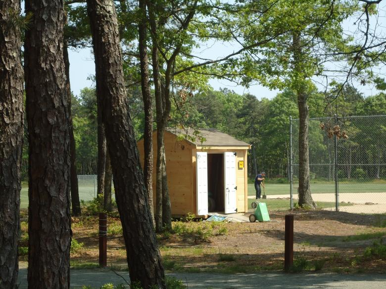

# Overview 

This repo is a public working shed for some general work and explorations. 

Source: https://www.stockvault.net/photo/131287/man-working-shed

# Kubefirst Related tools in the Shed

- [Cloud Installer in a Container](working-shed/cobra_dev/README.md)
- [Local Installer in a Container](working-shed/cobra_k3d/README.md)

# Explore Golang

Explore golang ecosystem scenarios to improve some code patterns usage as it goes and tooling knowlodge. 
